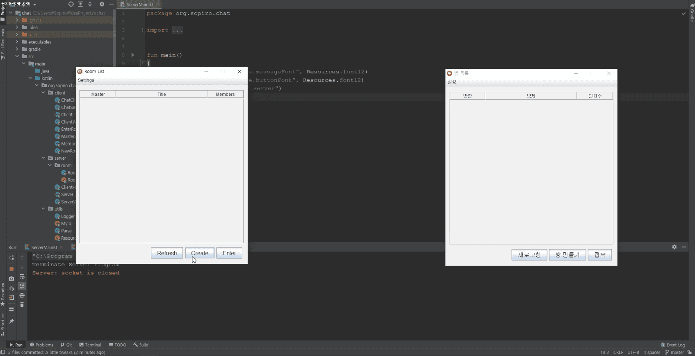
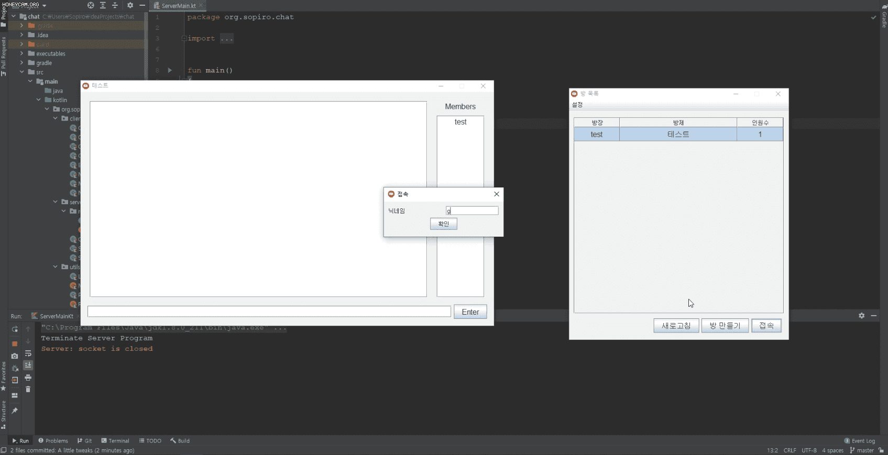

# Room based Peer-to-Peer Chat Server

If you create a room, you do host the server! [Peer-to-peer(P2P)](https://en.wikipedia.org/wiki/Peer-to-peer)!

Video: https://youtu.be/hDJYDsDg6Cs

## Features
- Master name server
- p2p Architecture
- Coroutine based synchronous server model
- Cross-platform(Windows, Linux, macOS)  

## Preview

